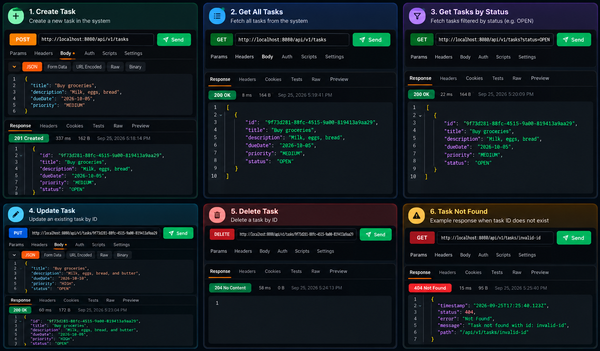

## REST API Outputs

The following demonstrates the complete Task Management REST API workflow:

- Create Task — `POST`
- Get All Tasks — `GET`
- Filter Tasks by Status — `GET`
- Update Task — `PUT`
- Delete Task — `DELETE`
- Error Handling — `404 Not Found`

